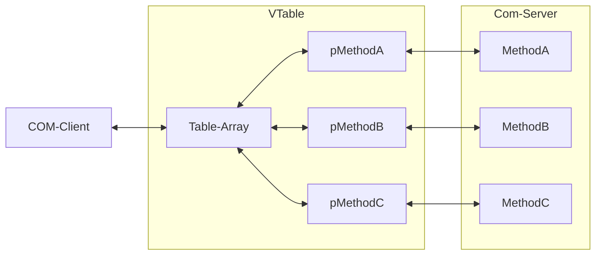

# So, you need to write a COM+ Application


### Background

Component Object Model (COM) is a framework introduced by Microsoft for use within Windows and provides inter-process communication (IPC). COM is the underlying functionality that implemented and used to create a related framework called Object Linking and Embedding (OLE). OLE is a framework initially developed so that applications such as Microsoft Excel could communicate with other Microsoft products, such as Microsoft Word. OLE is what allows you to embed an Excel spreadsheet within a Word document and have the contents automatically update as they change. While OLE is specific to embedding documents within one another, COM is a generic IPC solution that can be utilized in many ways. Eventually, as computer networking matured, COM was expanded into COM+. The main enhancement was the ability to perform IPC across difference computers, enabling distributed workloads. COM and OLE were eventually wrapped together into the, now deprecated, ActiveX framework which focused on bringing this technology into the web.  

> For the purposes of this documentation, we will only focus on COM applications communicating within a single host. COM and COM+ can be used interchangeably, as the modern framework is technically called COM+ (even if you do not utilize the networking functionality).


### COM/COM+ 

COM can be thought of as an abstraction layer between two pieces of code which need to interact with one another; COM is a standard which libraries can utilize for **binary** communication. As it is just a standard, COM components can be written in a number of different languages. Likewise, callers of these components do not need to be concerned with the language a component is written in. The only requirement for a language to use COM is that it has a concept of pointers and may implicitly or explicitly call those pointers. We'll see why this is needed a little later on.

Often (though not always) COM **components** (or **classes**) are considered to be **unmanaged code**, or code which does not have an entry point. In Windows, the core file type which provides unmanaged code are called Dynamic Link Libraries. The idea is that unmanaged code can provide utility functions and may be used by a number of different programs at a time. The primary benefit of COM is that it provides a means of advertising a public interface which can be used to invoke the code packaged within. When a COM component is called from another process, the component is referred to as the "COM Server", while the caller is referred to as the "COM Client". COM components may explicitly mark themselves as servers or clients, enforcing proper use. The caller of a COM server is not aware of any aspect of that component other than its advertised interface and the methods detailed within that interface. COM classes can be packaged as either Dynamic Link Libraries (DLL) or as executables (EXE), though _this documentation will focus specifically on COM components packaged as DLLs_.

A Major benefit of COM as an abstraction layer is that libraries can be updated or reimplemented entirely without causing errors in other programs which use that component. So long as the public interface stays the same, callers are none the wiser. However, because there is a strong dependence on a stable public API it is difficult to change that API once it has been released. API changes are often additive processes. Drastic changes to the public API in unmanaged code can result in what is often referred to as ['DLL Hell'](https://en.wikipedia.org/wiki/DLL_Hell). 

# The COM Virtual Function Table 

COM produces an interface for unmanaged code which can be called at any point by any allowed process, and this interface is represented logically within a 'Virtual Function Table' (VTable). This table is simply a pointer to an array of pointers each pointing to a particular method within a component. These methods are only callable via these pointers, and no other aspect of the component can be accessed by the caller. The use of a VTable is why COM components and callers must be implemented using a language which has a concept explicit or implicit calls on pointers within its syntax. The creation of the VTable is done via the Windows API - COM callers can not instantiate COM servers directly. 




## Implementing a COM+ Component in C# 

> **Note:** For the purposes of this documentation, we will only focus on COM components written in C#. 


In OOP terminology, the COM interface can be thought of as an _abstract class_, which details the available methods but **cannot be used to create new instances of the component**. Additional classes and methods must be written within the component to implement the interface. This pairing of interfaces and implementing classes is represented within the VTable. The initial pointer provides a means to access the VTable while the array of pointers outlines the interface, and each pointer within the array provides access to the actual implementation of the interface. These implementation classes are often referred to as **co-classes**, and can be thought of as class factories. These factories are instantiated using the Windows API, which will build out the VTable and in the process create the CoClass for the component.


An example of C# COM interface and implementing class would look something like the following:

```c#
using System.EnterpriseServices;
using System.Runtime.InteropServices;

namespace my.com.namespace
{
    [Guid("6ECDA518-2010-4437-8BC3-46E752B7B172")]
    [InterfaceType(ComInterfaceType.InterfaceIsIUnknown)]
    [ComImport]
    public interface ICcgDomainAuthCredentials
    {
        void GetPasswordCredentials(
            [MarshalAs(UnmanagedType.LPWStr), In] string pluginInput,
            [MarshalAs(UnmanagedType.LPWStr)] out string domainName,
            [MarshalAs(UnmanagedType.LPWStr)] out string username,
            [MarshalAs(UnmanagedType.LPWStr)] out string password);
    }

    [Guid("e4781092-f116-4b79-b55e-28eb6a224e26")]
    [ProgId("CcgCredProvider")]
    public class CcgCredProvider : ServicedComponent, ICcgDomainAuthCredentials
    {
        void GetPasswordCredentials(
            [MarshalAs(UnmanagedType.LPWStr), In] string pluginInput,
            [MarshalAs(UnmanagedType.LPWStr)] out string domainName,
            [MarshalAs(UnmanagedType.LPWStr)] out string username,
            [MarshalAs(UnmanagedType.LPWStr)] out string password)
            {
              ...
            }
    }
}
```


Let's break down the code example and explain the specifics unique to a COM component: 


All classes implementing the COM interface are uniquely identified using a GUID, which is referred to as its Class ID (`CLSID`). In the above example, the CLSID is specified using the `Guid` attribute of the `CcgCredProvider` class, and its value is `e4781092-f116-4b79-b55e-28eb6a224e26`. When registered into a system, all COM components **must** have a unique CLSID. In the (very unlikely) event that there _is_ a CLSID collision, COM components may also specify a Program ID (`ProgID`), which is a plain text name given for the component and can be used as an ID fallback. In the above example, the Program ID is specified as an attribute of the `CcgCredProvider` class and has a value of `CcgCredProvider`. Additionally, all COM interfaces also have another unique GUID, called an Interface ID (`IID`). In the above example, the Interface ID is specified as an attribute of the COM interface, and has a value of `6ECDA518-2010-4437-8BC3-46E752B7B172`. Interface IDs are useful for applying security restrictions on the COM component, and are sometimes called `AppIds`. There are additional attributes and annotations which can be added to COM components, however these few should always be used. 

All COM classes implemented in OOP languages must inherit the `IUnknown` class. This base class provides a means of advertising the COM interfaces to callers. In Languages such as C#, which utilizes the .NET Framework, additional dependencies are needed for the proper creation of a COM component. Classes which implement the COM interface must inherit the `ServicedComponent` class from the `System.EnterpriseServices` library. While `IUnknown` promotes an _interface_ to COM callers, `ServiedComponent` provides the base logic for the implementing class to advertise as a **COM+** component.  

COM components _should_ implement their interfaces using specific naming conventions. For instance, all interfaces _should_ be prefixed with the character 'I', and they must be [strongly typed](https://www.fluentcpp.com/2016/12/08/strong-types-for-strong-interfaces/). The use case for which you are building a COM component is important to consider during implementation. For instance, if you are building a component for use by another _existing_ program, your component **must** adhere to the callers expectations of the component.

## Registering a COM component within Windows 

In order for another application to invoke your COM component, its presence must be known by the caller. This is often done by way of the Windows registry, and Microsoft provides several applications to facilitate this registration process. Programs such as `regsvc.exe` and `regasm.exe` can be used to instantiate COM DLLs onto a Windows system, automatically modifying the Windows registry and generating any additional files required to support the calling of the DLL. Depending on how the caller of your DLL looks for your component, additional registry or filesystem changes may be required.


