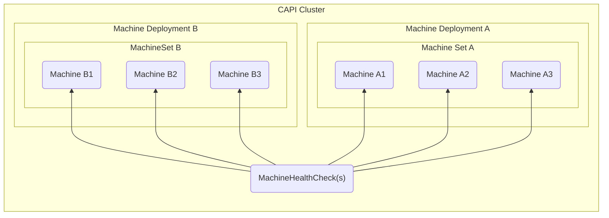

# CAPI Installation

To use CAPI, a user must install the **CAPI controllers & CRDs** and one or more **CAPI "Provider" controllers & CRDs** onto a single cluster known as the **local / management** cluster.

This is generally achieved by running `clusterctl init`.

Once CAPI is installed, to create a cluster managed by CAPI (also known as a **downstream** cluster), a user will have to create a number of CAPI resources at the same time in the **local / management** cluster that reference CAPI Provider resources that are created alongside it, including:
- A `Cluster`, which identifies a `<Distribution>Cluster` and `<Distribution>ControlPlane` CR that implements it
- One or more `Machine`s, each of which identify a `<Infrastructure>Machine` and `<Distribution>Bootstrap` CR that implements it
    - A `MachineDeployment` / `MachineSet` similarly references a `<Infrastructure>MachineTemplate` and `<Distribution>BootstrapTemplate` CRs to create a set of `Machine`s, `<Infrastructure>Machine`s, and `<Distribution>Bootstrap`s per replica requested in the spec

> **Note**: `MachineDeployment` : `MachineSet` : `Machine` has the same relationship as `Deployment` : `ReplicaSet` : `Pod`

- One or more `MachineHealthCheck`s, each of which identify periodic actions that need to be executed on `Machine`s to verify they are healthy

> **Note**: On a failed `MachineHealthCheck`, a `Machine` that is part of a `MachineSet` gets deleted and replaced with a fresh `Machine`

You can visualize the relationship between CAPI CRDs **alone** with the following graph:

> **Note** Notice that while `MachineDeployment`, `<Distribution>BootstrapTemplate`, and `<Infrastructure>MachineTemplate` are **mutable**, the resources that they spawn (i.e. `MachineSet` / `Machine`, `<Distribution>Bootstrap`, and `<Infrastructure>Machine`) are considered to be **immutable**.
>
> This is an intentional pattern in CAPI since it allows CAPI to support **strategic upgrades** in production, rather than upgrading all-at-once.
>
> To clarify, when you modify one of the mutable resources listed above (`MachineDeployment`, `<Distribution>BootstrapTemplate`, and `<Infrastructure>MachineTemplate`), all immutable resources that the spawned **prior to the mutation** are left unaffected by the change; instead, a new set of those same immutable resources (i.e. a new `Machine`, `<Distribution>Bootstrap`, and `<Infrastructure>Machine`) are spawned based on the new configuration.
>
> Once the new `Machine` is Ready, CAPI will then proceed to get rid of the previous set of immutable resources (i.e. the old `Machine`, `<Distribution>Bootstrap`, and `<Infrastructure>Machine`) since they are no longer required.

The manifest containing these resources is what is normally produced by running `clusterctl generate cluster` with the appropriate command-line arguments.

Once these resources are created, it's expected that the CAPI "Provider" controllers will do the "real" work to provision the cluster.
