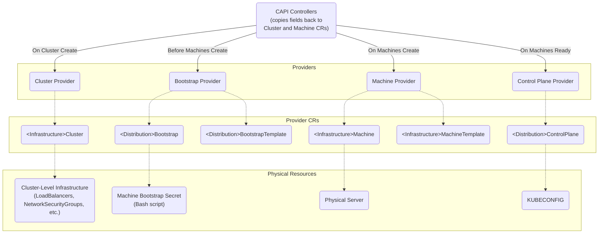

# CAPI Provisioning

On a high-level, here is how CAPI provisions clusters after users run a command like `clusterctl generate cluster [name] --kubernetes-version [version] | kubectl apply -f -`:

1. Create cluster-level infrastructure pieces **(handled by [Cluster Infrastructure Provider](./terminology.md#cluster-infrastructure-provider))**

2. **ONLY IF** using `MachineDeployment` / `MachineSet`: Create `Machine`, `<Infrastructure>Machine`, and `<Distribution>Bootstrap` objects resources for each replica requested in the `MachineSet` spec **(handled by CAPI Controllers)**

3. Create a Machine Bootstrap Secret per `<Distribution>Bootstrap` that contains the script that needs to be installed right after provisioning a machine to add it to the Kubernetes cluster **(handled by [Bootstrap Provider](./terminology.md#bootstrap-provider))**

4. Provision a physical server per `<Infrastructure>Machine` by contacting the infrastructure provider (i.e. AWS, Azure, etc.) and running the bootstrap script in the Machine Bootstrap Secret on the machine before marking it as Ready **(handled by [Machine Provider](./terminology.md#machine-infrastructure-provider))**

5. Copy the `<Infrastructure>Machine` fields over to the corresponding CAPI `Machine` **(handled by CAPI Controllers)**

6. Initialize the cluster's controlplane (only once all `Machine`s are marked as Ready) using the configuration on the `<Distribution>ControlPlane` and join the bootstrapped nodes onto the controlplane; once all `Machine`s are joined, create a `KUBECONFIG` that can be used to access the newly provisioned cluster's Kubernetes API **(handled by [ControlPlane Provider](./terminology.md#control-plane-provider))**

7. Copy the `<Distribution>ControlPlane` fields over to the corresponding CAPI `Cluster`, specifically including the control plane endpoint that can be used to communicate with the cluster **(handled by CAPI Controllers)**

Once these steps have been taken, a user can run `clusterctl get kubeconfig` to access the newly provisioned downstream cluster's Kubernetes API.

