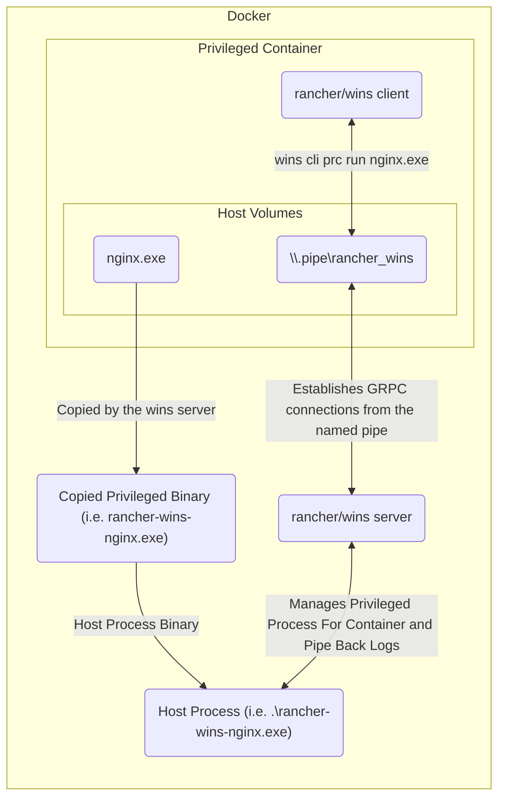
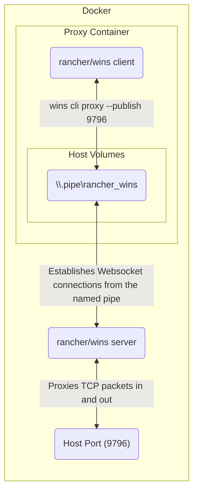

# Wins

[`rancher/wins`](https://github.com/rancher/wins) is a daemon installed on a Windows host that allows Windows containers to operate processes that run directly on the Windows host.

It was historically used to support adding Windows hosts onto [RKE1](./rke1.md) clusters but is still used in [RKE2](./distributions.md) for Windows hosts today.

> **Note**: In RKE2 Windows only, wins runs an embedded [System Agent](./system_agent.md) within itself.
>
> This ensures that only a single daemon needs to be installed onto Windows hosts.
>
> Please refer to the docs on [System Agent](./system_agent.md) for more details.

## Why was `wins` built?

Historically, to support deploying Kubernetes on Windows hosts that were running Docker Engine for Windows, there were three primary issues that needed solutions:

1. Windows has historically required users to build Windows container images per Windows server version (i.e. you cannot deploy Windows 2019 container images on Windows 20H2 hosts).
2. Docker Engine for Windows does not support **privileged** containers (i.e. containers that run as host processes with host-level privileges in the host network)
3. Docker Engine for Windows does not support **hostNetwork** containers (i.e. containers that do not need host-level privileges but need to be on the host network to make requests to internal services, such as the [Windows Management Instrumentation](https://learn.microsoft.com/en-us/windows/win32/wmisdk/wmi-start-page) service to collect node-level statistics for monitoring)

While Rancher solved the first problem by pushing images for each Windows server version supported and utilizing an [image manifest](https://www.howtogeek.com/devops/what-is-a-docker-image-manifest/) to point a host to the correct "layer" to download for each server version, the latter two problems required a technical solution that could allow Rancher to still manage the Kubernetes components that needed deployment as privileged (or hostNetwork) containers to get Kubernetes set up on the Windows host.

## How does it work?

### Running privileged processes

`wins` is a daemon installed onto a Windows host as a [`System Service`](https://learn.microsoft.com/en-us/windows/win32/system-services) (like `systemd` on a Linux server, it manages processes that need to persist across events like host reboots).

The daemon side of `wins` runs a [GRPC server](https://grpc.io/) on the host that listens for requests through a [`Named Pipe`](https://learn.microsoft.com/en-us/windows/win32/ipc/named-pipes) (like a [Unix domain socket](https://en.wikipedia.org/wiki/Unix_domain_socket)). The corresponding GRPC client runs within a container.

To allow a container to deploy a privileged process, wins incorporates a **"two-way handshake"** between files on the containers and files on the host via [`hostPath` volumes](https://kubernetes.io/docs/concepts/storage/volumes/#hostpath).

Since this Named Pipe is a file located at `\\.\pipe\\rancher_wins`, you can **volume mount the Named Pipe** onto Docker containers that need to run privileged processes; this makes the pipe accessible to processes running within a container.

Similarly, you can **volume mount the host process binary within the container image** onto the host. This makes the binaries accessible to the `wins` daemon running on the host.

To wire this all together, the `wins` GRPC client on the container issues a `wins cli prc run` request via the Named Pipe. This establishes a GRPC connection with the wins server via the Named Pipe that tells the `wins` server where to find the binary and what arguments to start it with.

After starting the process as instructed **on the host**, the `wins` server then pipes back the logs of the existing process back over to the `wins` client side binary, which emits it as its own logs.

### Exposing `hostNetwork` processes

A second named pipe, `\\.pipe\\rancher_wins_proxy`, was added to support exposing ports in the `hostNetwork` using `wins cli proxy`.

The primary difference between the two is that, unlike `\\.pipe\\rancher_wins`, `\\.pipe\\rancher_wins_proxy` allows wins clients to establish [Websocket](https://en.wikipedia.org/wiki/WebSocket) connections; on receiving a connection from a `wins` client, the `wins` server pipes any TCP packets sent down the wire directly to its host network and vice-versa, effectively building a tunnel that creates a bridge between the Docker container's network and the host network at that port.

> **Note**: Why was this necessary?
>
> `windows-exporter` is a component deployed by Monitoring V2; it collects metrics by querying an endpoint on the host network offered by the [Windows Management Instrumentation (WMI)](https://learn.microsoft.com/en-us/windows/win32/wmisdk/wmi-start-page) service running on each host.
>
> To access WMI, we needed `windows-exporter` to run as a host process, but this meant that we would need to **expose a host-level port to all nodes in the cluster** to allow Prometheus (which can be on any host in the cluster) to communicate with it.
>
> By creating a bridge between the container's port and the host port, this was no longer necessary; Kubernetes built-in service discovery capabilities allowed Prometheus to find and access the container's port, which allowed it to communicate with the underlying host at that port via the wins proxy.