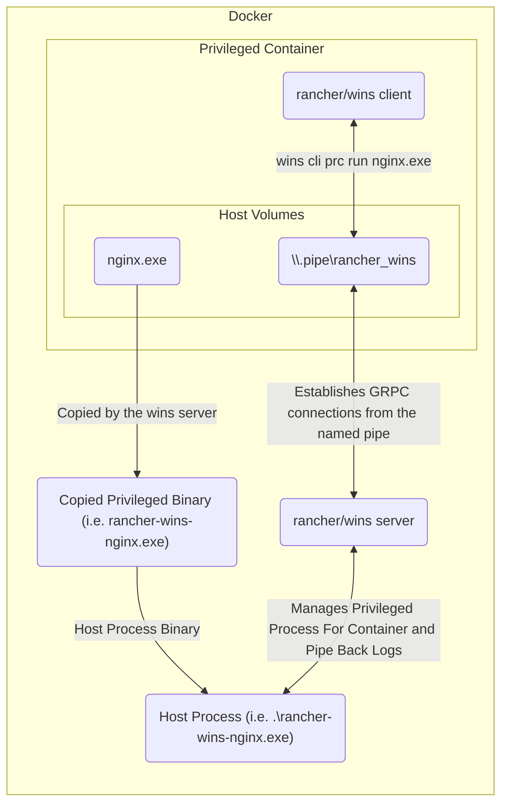

# RKE1 Windows

> **Note**: RKE1 Windows is no longer supported. Please see [SUSE Support's document](https://www.suse.com/support/kb/doc/?id=000020684) on this.
>
> This document exists for posterity to identify and document the design of RKE1 Windows and how to debug it.

## What is RKE1?

RKE1 (Rancher Kubernetes Engine) is a **Kubernetes distribution** offered by Rancher.

> **Note**: What is a Kubernetes distribution?
>
> A Kubernetes distribution is a collection of software components that, when deployed together onto a set of servers, forms a Kubernetes cluster.
>
> The software components generally include Kubernetes components such as kubelet, kube-apiserver, kube-controller-manager, etc. but also include certain distribution-specific technologies, such as an embedded container runtime like containerd.
>
> You install a distribution onto a set of servers via a piece of software known as a **provisioner**; for example, Rancher serves as a provisioner of RKE1 / RKE2 clusters (where Rancher can also provision the underlying cloud provider hosts for you as well or provide a registration command to add your own hosts onto a custom cluster).

While RKE1 used to support adding Windows nodes to create mixed OS clusters with both Windows and Linux nodes, **RKE1 Windows is no longer supported by Rancher**; Rancher supports RKE1 clusters with Linux nodes.

For users who still use Windows nodes on their Kubernetes clusters or for users who would like to migrate to the latest that Rancher has to offer, Rancher has a new offering called [**RKE2**](https://github.com/rancher/rke2).

> **Note**: One way to see RKE2 is as a different flavor of [**k3s**](https://github.com/k3s-io/k3s) that focuses on security and compliance within the U.S. Federal Government sector, which is why it's often also called **RKE Government**.
>
> You can generally assume that **most** of the design of RKE2 applies to k3s.

This newer distribution avoids some of the pitfalls baked into the design of RKE1; notable difference include, but are not limited to:

1. RKE1 relies on an **"externally" managed [Docker](https://www.docker.com)** (or Docker Engine) running on the host as the underlying [container runtime](https://opensource.com/article/21/9/container-runtimes), whereas RKE2 provides an **embedded [containerd](https://containerd.io/)** that comes as part of the RKE2 installation process itself. This reduces a lot of user bugs around invalid host [dockerd](https://docs.docker.com/engine/reference/commandline/dockerd/) configurations since RKE2 retains **full control over the configuration of the container runtime** it ships within the RKE2 binary itself.
2. RKE1 has an **imperative** model of installation / upgrade relying on an **external** host (i.e. your computer or the Rancher server) running commands like `rke up` to get the nodes up and running. This requires the external host to be **capable of SSHing into each of the nodes**. RKE2 follows a **declarative** model of installation / upgrades that happens **directly on the host**. To do this, each host registers RKE2 as a **[systemd unit](https://www.digitalocean.com/community/tutorials/what-is-systemd)** that watches for changes to a configuration file to perform configuration updates. This makes RKE2 more suitable for declarative provisioning solutions like **booting up nodes via [cloud-init](https://cloud-init.io) or [Terraform](https://www.terraform.io)**.
3. RKE1 makes **Docker client calls** to deploy system components (kubelet, kube-proxy, etc.) as **Docker containers**. You can debug RKE1 via commands like `docker ps` or `docker log`. RKE2 deploys system components as **static pods managed by kubelet itself**. You can debug RKE2 via commands like `crictl ps` or `crictl logs` (since containerd is the underlying container runtime for RKE2).
4. RKE1 supports certain CNI plugins (Canal, Flannel, Calico, and Weave), whereas RKE2 supports a different set of CNI plugins (Cilium, Calico, Canal and Multus) for Linux clusters. For Windows clusters, RKE supports Flannel and RKE2 supports Canal.
5. RKE2 introduces the idea of a **supervisor port** (port 9345) that runs on every "server" (controlplane / etcd) node. This port serves as a sort of ["service mesh"](https://en.wikipedia.org/wiki/Service_mesh) / "registration" port that allows new server and agent nodes to establish basic connectivity, often based on the first server node (often referred to as the **init** node). Since this network exists independently and as a precursor to the creation of the actual Kubernetes network established by the cluster's [Container Network Interface (CNI)](https://kubernetes.io/docs/concepts/extend-kubernetes/compute-storage-net/network-plugins/) plugin, RKE2 can use kubelet (which proxies requests to the API Server via this port) to manage all other Kubernetes components on the host, including the CNI plugin itself (deployed as a [Helm chart](https://helm.sh/) managed by the embedded RKE2 [helm-controller](https://github.com/k3s-io/helm-controller)).
6. As a distribution, RKE2 **natively supports adding Windows nodes**; in RKE1, the provisioner (i.e. **Rancher**) performed this job.

## How does RKE1 Windows work?

To support deploying RKE1 on Windows hosts, there were three primary issues that needed solutions:

1. Windows has historically required users to build Windows container images per Windows server version (i.e. you cannot deploy Windows 2019 container images on Windows 20H2 hosts).
2. Docker Engine for Windows does not support **privileged** containers (i.e. containers that run as host processes with host-level privileges in the host network)
3. Docker Engine for Windows does not support **hostNetwork** containers (i.e. containers that do not need host-level privileges but need to be on the host network to make requests to internal services, such as the [Windows Management Instrumentation](https://learn.microsoft.com/en-us/windows/win32/wmisdk/wmi-start-page) service to collect node-level statistics for monitoring)

> **Note**: Upon the [deprecation of Dockershim support in Kubernetes 1.20](https://techcommunity.microsoft.com/t5/apps-on-azure-blog/dockershim-deprecation-and-aks/ba-p/3055902) (removed in Kubernetes 1.24), another problem arose; to use Docker as a container runtime for Kubernetes (which is what RKE1 expects), a distribution must deploy [`cri-dockerd`](https://github.com/Mirantis/cri-dockerd), a [shim](https://en.wikipedia.org/wiki/Shim_(computing)) that allows Kubernetes to communicate with Docker via the expected [Container Runtime Interface (CRI)](https://kubernetes.io/docs/concepts/architecture/cri/), to use Docker as the container runtime.
>
> This conflicts with Microsoft's guidance since Microsoft does not recommend using `cri-dockerd` and has deprecated Docker on Windows hosts; this is the core reason why RKE1 Windows reached End of Life (EOL).
>
> Since RKE2 uses containerd instead of Docker, it can still support Windows hosts.

While Rancher solved the first problem by pushing images for each Windows server version supported and utilizing an [image manifest](https://www.howtogeek.com/devops/what-is-a-docker-image-manifest/) to point a host to the correct "layer" to download for each server version, the latter two problems required a technical solution that could allow Rancher to still manage the Kubernetes components that needed deployment as privileged (or hostNetwork) containers to get Kubernetes set up on the Windows host.

This is where [`rancher/wins`](https://github.com/rancher/wins) comes into play.

### `wins cli prc run`



`wins` is a daemon installed onto a Windows host as a [`System Service`](https://learn.microsoft.com/en-us/windows/win32/system-services) (like `systemd` on a Linux server, it manages processes that need to persist across events like host reboots).

The daemon side of `wins` runs a [GRPC server](https://grpc.io/) on the host that listens for requests through a [`Named Pipe`](https://learn.microsoft.com/en-us/windows/win32/ipc/named-pipes) (like a [Unix domain socket](https://en.wikipedia.org/wiki/Unix_domain_socket)). The corresponding GRPC client runs within a container.

To allow a container to deploy a privileged process, wins incorporates a **"two-way handshake"** between files on the containers and files on the host via [`hostPath` volumes](https://kubernetes.io/docs/concepts/storage/volumes/#hostpath).

Since this Named Pipe is a file located at `\\.\pipe\\rancher_wins`, you can **volume mount the Named Pipe** onto Docker containers that need to run privileged processes; this makes the pipe accessible to processes running within a container.

Similarly, you can **volume mount the host process binary within the container image** onto the host. This makes the binaries accessible to the `wins` daemon running on the host.

To wire this all together, the `wins` GRPC client on the container issues a `wins cli prc run` request via the Named Pipe. This establishes a GRPC connection with the wins server via the Named Pipe that tells the `wins` server where to find the binary and what arguments to start it with.

After starting the process as instructed **on the host**, the `wins` server then pipes back the logs of the existing process back over to the `wins` client side binary, which emits it as its own logs.

### `wins cli proxy`

```mermaid
graph LR;
subgraph Docker
subgraph Proxy Container
WinsClient("rancher/wins client")
subgraph Host Volumes
WinsPipe("\\.pipe\rancher_wins")
end
end
WinsServer("rancher/wins server")
HostPort("Host Port (9796)")

WinsClient<--wins cli proxy --publish 9796-->WinsPipe
WinsPipe<--Establishes Websocket connections from the named pipe-->WinsServer
WinsServer<--Proxies TCP packets in and out-->HostPort
end
```

Rancher later added in a second named pipe `\\.pipe\\rancher_wins_proxy` to support hostNetwork processes.

The primary difference between the two is that, unlike `\\.pipe\\rancher_wins`, `\\.pipe\\rancher_wins_proxy` allows wins clients to establish [Websocket](https://en.wikipedia.org/wiki/WebSocket) connections; on receiving a connection from a `wins` client, the `wins` server pipes any TCP packets sent down the wire directly to its host network and vice-versa, effectively building a tunnel that creates a bridge between the Docker container's network and the host network at that port.

> **Note**: Why was this necessary?
>
> `windows-exporter` is a component deployed by Monitoring V2; it collects metrics by querying an endpoint on the host network offered by the [Windows Management Instrumentation (WMI)](https://learn.microsoft.com/en-us/windows/win32/wmisdk/wmi-start-page) service running on each host.
>
> To access WMI, we needed `windows-exporter` to run as a host process, but this meant that we would need to **expose a host-level port to all nodes in the cluster** to allow Prometheus (which can be on any host in the cluster) to communicate with it.
>
> By creating a bridge between the container's port and the host port, this was no longer necessary; Kubernetes built-in service discovery capabilities allowed Prometheus to find and access the container's port, which allowed it to communicate with the underlying host at that port via the wins proxy.

## Debugging RKE1 Windows

## Find the Kubernetes component logs

Grab the Docker logs and see what's going on:

```powershell
# Find the cattle-node-agent container ID via docker ps
$CATTLE_NODE_AGENT_CONTAINER_ID = ""
docker logs $CATTLE_NODE_AGENT_CONTAINER_ID -f

docker logs kubelet -f
docker logs kube-proxy -f
docker logs nginx -f
docker logs service-sidekick -f
```

## Identify host processes managed by wins

Get details about the host processes managed by `wins` (which will always follow the copied binary format, which is the binary name prefixed with `rancher-wins-`):

```powershell
Get-WmiObject Win32_Process -filter "CommandLine LIKE '%rancher-wins-%'"
```

## Clean up any orphaned hosts processes

This is the right thing to do if you see an unauthorized error on renaming an executable in the logs; this indicates that `wins` cannot create the copied version of the binary from the container because an orphaned process is still running the older version of it:

```powershell
Get-WmiObject Win32_Process -filter "CommandLine LIKE '%rancher-wins-%'" | Remove-WmiObject
```
