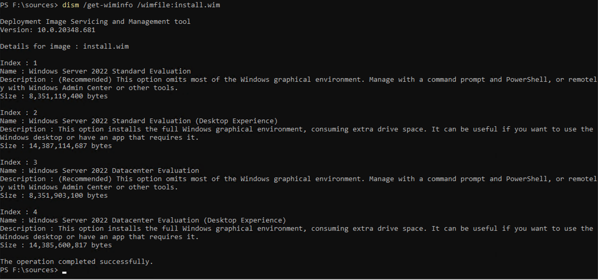

# Creating Windows VM templates for use by Rancher in vSphere

This documentation describes specifics about the process of creating Windows vSphere templates for internal use by Rancher employees. This documentation focuses primarily on Windows templates, and does not touch on creating Linux templates.

## Background

VMWare vSphere is a cloud computing virtualization platform used to provision and deploy virtual machines on premises. vSphere offers advantages over managed cloud providers such as reduced cost of VM deployment (after initial hardware investment), control over the specific hardware used to run VMs, and the ability to deploy closer to the physical locations using the VMs, potentially reducing networking costs.

vSphere is a manual platform, users must bring their own hardware and expertise in order to create a capable vSphere cluster which VMs run on. Since vSphere is not a managed service, users must manually create and deploy VMs onto their cluster as needed. In cases where multiple VMs require the same dependencies or OS packages, creating **VM Templates** is desirable.

### VM Templates

A VM template is a "Golden Image" which has all required packages, programs, and OS level updates preinstalled. This ensures that future VMs created from that template will not need to go through the same configuration steps, greatly reducing the time required to deploy new VMs. As vSphere is a manual cloud provider, users must go through the process of creating VM templates manually.


### VM Template Creation Methods

vSphere Users create VM templates in multiple ways. In the simplest case, users can manually provision a VM after uploading a publicly available OS ISO to their vSphere server. They can then manually install all programs and applications needed for future VM instances. This is a common way to create VM templates which require minimal configuration, however this is a time-consuming method which is prone to human error.


If manually creating templates is too time-consuming, [Hashicorp Packer](https://developer.hashicorp.com/packer) automates the creation of templates. Packer uses the hcl language to define VM configurations in vSphere, which ISO a VM will use, and what commands must execute in order to configure the VM. Packer is a useful tool which greatly reduces the time to create VM templates as well as eliminates potential user error which could arise during manual templating. This process is the recommended way to create VM templates for use by Rancher, and a [dedicated repository](https://github.com/HarrisonWAffel/vsphere-templates-for-rancher) allows Rancher employees to automatically build Windows images.

### VM Template Creation Considerations

It is critical that a VM template remove all instance specific properties generated during the templating process. This includes values such as the hostname and IP address, as these must be unique to each VM instance created from a VM template. "**Generalization**" is the process of removing these instance specific properties while creating a VM template.


> [!NOTE]
> This documentation does not cover the process of generalizing Linux images


## VM Templating For Windows

Creating a Windows Server ISO requires knowledge of low level Windows components and concepts. This includes details on the layout of Windows ISO's, how CloudBase init differs from the standard Cloud Init used by Linux hosts, and how unattend files and Hashicorp Packer bootstrap Windows VMs.

### Hashicorp Packer

Packer is a VM templating tool which provides a way to automatically create and manage VM templates in vSphere. It uses the hcl language to describe VM templates in a similar manner to how Terraform describes cloud infrastructure. Rancher maintains our own Packer templates for vSphere VM templates [here](../../vsphere-templates).


The following sections speak on specific aspects of creating Windows VM templates. These nuances and details are already implemented in the Packer automation. Nevertheless, understanding the files which play a role in the process and why the automation uses specific settings is important for future maintenance.

### The Windows Server ISO

When creating Windows VMs in the Rancher vSphere environment, VMs must use Windows Server Evaluation Edition ISOs as these ISOs do not need a product key. Each Windows Server ISO will contain two different OS versions which each have two different variants:

1. Windows Server Standard edition, including the Core and Desktop variants
2. Windows Server Datacenter edition, including the Core and Desktop Variants


Since a single ISO can install multiple different OS versions, each ISO contains an index which denotes what parts of the ISO belong to a particular version. The `install.wim` file describes all OS versions included in an ISO. Users can mount `install.wim` and view all available OS versions using a simple PowerShell command. `dism /Get-WimInfo /Wmifile:<FILENAME>` will print a summary of the `install.wim` file, including properties used by unattend files to select OS versions. Properly selecting a version from this file is critical when automating the VM templating process.




The vSphere-Templates-For-Rancher repository selects particular OS versions using a number which represents the index for each version in the `install.wim` file ([Source](https://github.com/HarrisonWAffel/vsphere-templates-for-rancher/blob/c402f50e020394f178adbe17a05806f9bd413e1f/builds/windows/server/2022/windows-server.auto.pkrvars.hcl#L21-L24)). This is more reliable than using the string representation of different OS versions.


### Windows Unattend Answer Files

A standard installation of Windows will require the user to perform an initial setup, configuring settings such as the language, timezone, and default username and password. In situations where it is not desirable or possible to have a user configure Windows on initial installation, such as when templating a VM, The windows "Unattend Answer" file comes into play.


Unattend answer files (also known as an "Answer file") are XML files which automatically *answer* the questions that Windows asks on initial installation. This means that by providing an Unattend file the Windows installation is hands free.


When creating or modifying an answer file for vSphere templates, specific sections are important to understand. Each section is a discrete XML tag in the answer file.

1. [Windows PE](https://learn.microsoft.com/en-us/windows-hardware/manufacture/desktop/windowspe?view=windows-11)
    - Windows PE, or Windows Preinstallation Environment, defines properties such as the Timezone, Keyboard layout and Language. This tag is also responsible for specifying the specific Windows server version from the multi-version ISO.
2. [Generalize](https://learn.microsoft.com/en-us/windows-hardware/manufacture/desktop/generalize?view=windows-11)
    - The generalize tag defines what should happen to installed devices and programs when generalizing the Windows instance during the templating process.
3. [Specialize](https://learn.microsoft.com/en-us/windows-hardware/manufacture/desktop/specialize?view=windows-11)
    - The specialize tag allows you to enable or disable default behavior of the Windows installation. For example, you can disable the Server manager GUI on initial start up in the specialize tag.
4. [Oobe (Out Of Box Experience)](https://learn.microsoft.com/en-us/windows-hardware/manufacture/desktop/oobesystem?view=windows-11)
    - Oobe automatically answers *all* the questions typically provided by a human during initial installation. This section is what allows automated solutions like Packer to install the OS ISO onto a VM without user interaction. It also provides a hook in which you can execute arbitrary scripts on initial startup.


### Sysprep

Windows packages a built-in program which generalizes the Windows install for future use. This program is responsible for removing instance specific properties such as the hostname, Security Identifier (SID), and network configuration. Effectively, sysprep 'cleans' the installation so that future VMs can use it. Executing sysprep should always be the **last** command that you run on during templating before shutting down the VM.


The sysprep command is by default located in `C:\Windows\Panther\sysprep.exe`. Users must provide an Unattend file to sysprep in order for it to understand how to generalize the Windows instance. Sysprep automatically writes two log files during execution that can be useful during debugging. `C:\Windows\Panther\setupact.log` describes the actions taken during sysprep setup, and `C:\Windows\Panther\setuperr.log` describes any errors encountered during the sys-prepping process. The Rancher packer automation [explicitly calls sysprep as the last command in the templating process](https://github.com/HarrisonWAffel/vsphere-templates-for-rancher/blob/fb0dc78793bb9efcf549312baa9f4a65f06fedb1/builds/windows/server/2022/windows-server.auto.pkrvars.hcl#L75).

### CloudBase Init

Much like Linux, a cloud init solution also exists for Windows. CloudBase init is a near one to one implementation of Cloud init for linux. CloudBase Init automatically configures VMs on startup, and plays a critical role in the Rancher provisioning process through the execution of provisioning scripts provided in the userdata. However, there are some differences between Cloud Init for Linux, and CloudBase Init. In general, Windows is not as flexible as Linux when changing properties such as the hostname. Additional reboots of the OS are often needed to ensure that the desired changes take effect.


You can configure how CloudBase Init functions by creating and updating the `C:\Program Files\Cloudbase Solutions\Cloudbase-Init\conf\cloudbase-init.conf` file. This file describes how to configure the host each time the Windows OS boots up. The Windows registry contains a list of CloudBase configuration passes, ensuring that properties like the hostname are not overwritten after a restart.


An example configuration file looks like the following,

```text
[DEFAULT]
username=rancher
groups=Administrators
inject_user_password=true
retry_count=6
retry_count_interval=10
first_logon_behaviour=no
bsdtar_path=C:\Program Files\Cloudbase Solutions\Cloudbase-Init\bin\bsdtar.exe
mtools_path=C:\Program Files\Cloudbase Solutions\Cloudbase-Init\bin\
verbose=true
debug=true
logdir=C:\Program Files\Cloudbase Solutions\Cloudbase-Init\log\
logfile=cloudbase-init.log
default_log_levels=comtypes=INFO,suds=INFO,iso8601=WARN,requests=WARN
logging_serial_port_settings=
mtu_use_dhcp_config=true
ntp_use_dhcp_config=true
local_scripts_path=C:\Program Files\Cloudbase Solutions\Cloudbase-Init\LocalScripts\
metadata_services=cloudbaseinit.metadata.services.nocloudservice.NoCloudConfigDriveService
netbios_host_name_compatibility=false
plugins=cloudbaseinit.plugins.common.mtu.MTUPlugin,
        cloudbaseinit.plugins.common.userdata.UserDataPlugin,
        cloudbaseinit.plugins.common.sethostname.SetHostNamePlugin,
        cloudbaseinit.plugins.common.setuserpassword.SetUserPasswordPlugin,
        cloudbaseinit.plugins.common.sshpublickeys.SetUserSSHPublicKeysPlugin,
        cloudbaseinit.plugins.windows.certificates.ServerCertificatesPlugin,
        cloudbaseinit.plugins.common.networkconfig.NetworkConfigPlugin,
        cloudbaseinit.plugins.common.localscripts.LocalScriptsPlugin
check_latest_version=true
allow_reboot=true
stop_service_on_exit=false
[config_drive]
types=iso,vfat
locations=cdrom
```

While a majority of these options are the default, two specific lines are important when creating a Windows VM for use by Rancher. `netbios_host_name_compatibility` must be equal to `false`, and the `SetHostNamePlugin` plugin must be present. These two options must be present in order for VMs created from the template to generate a unique hostname which is equal to the DNS name. In order for the vSphere cloud provider to function as expected, the hostname, DNS name, and VM name must match.

---

Now that you have a better understanding of the specific components and files that are critical to templating a Windows VM, it should be easier to understand and maintain the Packer automation found [here](https://github.com/HarrisonWAffel/vsphere-templates-for-rancher/tree/main).
